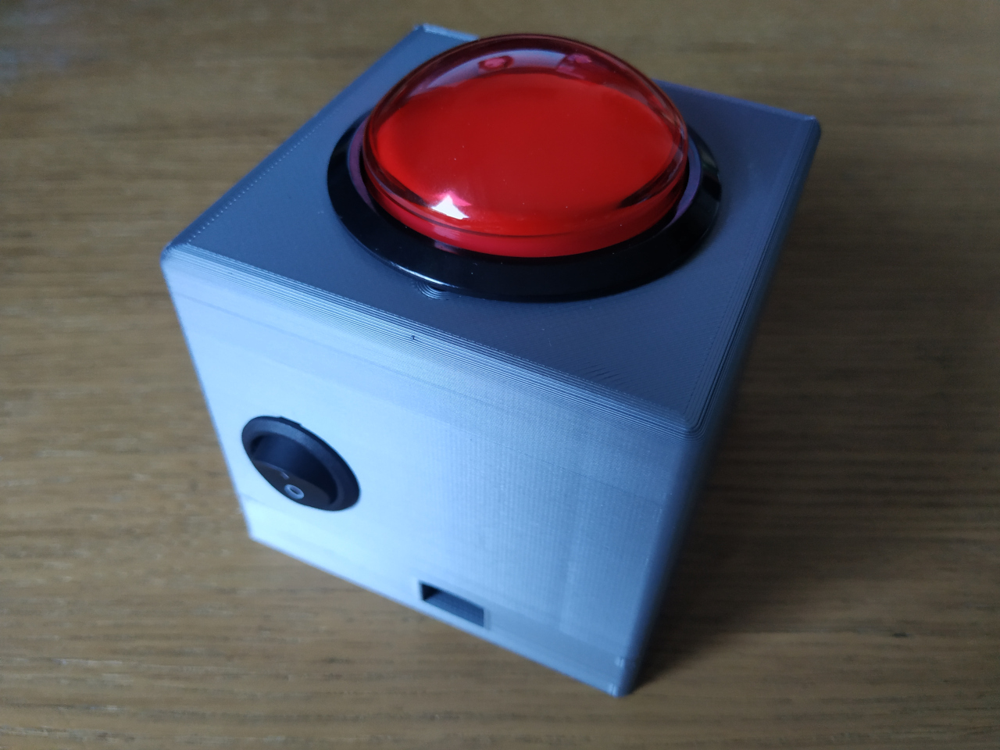
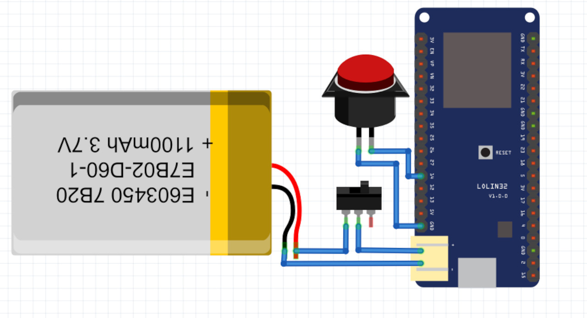

# Ultimate Blind Test Buzzer

## Brief
The Ultimate Blind Test Buzzer (ubt_buzzer) is a companion device for the Ultimate Blind Test. Its main goal
is to provide a basic user interface to allow blind test players to compete.

## Architecture
The buzzer relies on ESP32 with a button connected to it. The buzzer must connect to an access point which offers access to the Ultimate Blind Test server. Once connected, the Ultimate Blind Test server and the buzzer communicate over websocket, for configuration and for statuses (e.g : button pushed)

## Buzzer hardware configuration
* The buzzer is based on ESP32 board with a LiPo charge controller
* A battery can be connected onto the battery controller. Wiring a switch between the two elements allow a simple on/off feature on the buzzer
* The buzzer is meant to be used with a simple push button on GPIO 14 (no need to wire any pull resistor nor RC circuit, button is pulled and debounced by ESP32)

The following layout can be used as an example :

You can refer to the following components list :
* [AZ-Delivery ESP32 Lolin](https://www.az-delivery.de/fr/products/esp32-lolin-lolin32)
* [Basic Lithium-Polymer battery](https://fr.aliexpress.com/wholesale?trafficChannel=main&d=y&SearchText=1100+mah+lipo&ltype=wholesale&SortType=default&g=y&CatId=0), make sure to take a 3.7V battery with connector matching the one on ESP32 board
* [On/Off Switch](https://fr.aliexpress.com/wholesale?catId=0&initiative_id=SB_20220711124957&SearchText=on+off+switch&spm=a2g0o.productlist.1000002.0)
* [Arcade button](https://fr.aliexpress.com/wholesale?catId=0&initiative_id=SB_20220711125127&SearchText=big+arcade+button&spm=a2g0o.productlist.1000002.0)

## Buzzer sofware configuration
* Install ESP IDF SDK
* activate SDK with `export.sh`
* use `idf.py build` to build the project
* plug the buzzer to computer with an USB cable
* use `idf.py flash` to reflash the buzzer
* advanced user : you can use `idf.py monitor` to manage both previous steps and get device logs

## Buzzer network configuration
The project has a default network configuration applied, which can be tuned if needed. You can edit the network configuration by executing `idf.py menuconfig`, then selecting the "Buzzer configuration" menu.

## IDE configuration
The project has a basic Visual Studio code configuration, enable to Vscode "tasks" :
* build
* flash
Moreover, Intellisense is able to resolve ESP IDF symbols if your ESP IDF SK is at the same level than the project. You can edit ESP IDF path in `.vscode/c_cpp_properties.json` if you want to set another path.
