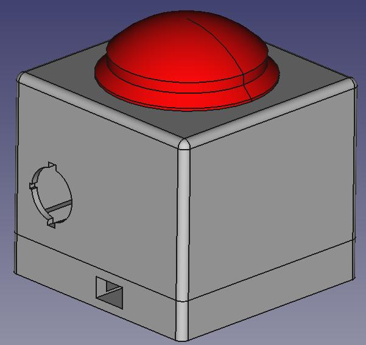
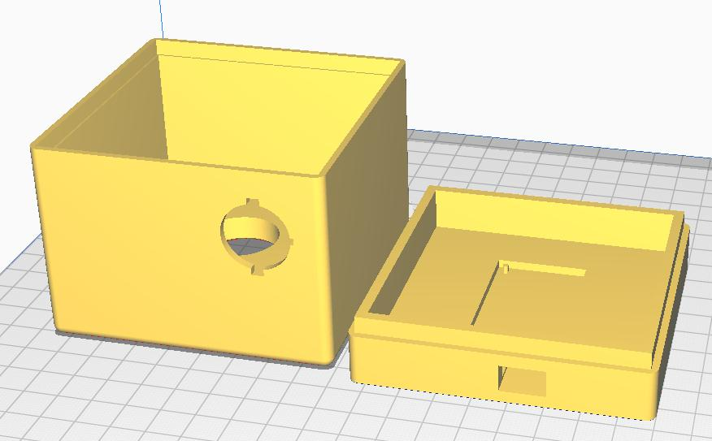

# Casing

The buzzer can be assembled in a 3D printed casing  :

The provided casing has been designed in [Freecad](https://www.freecadweb.org/). It is composed of two parts. Both can be printed without supports, you only need to print the top part upside-down : 
